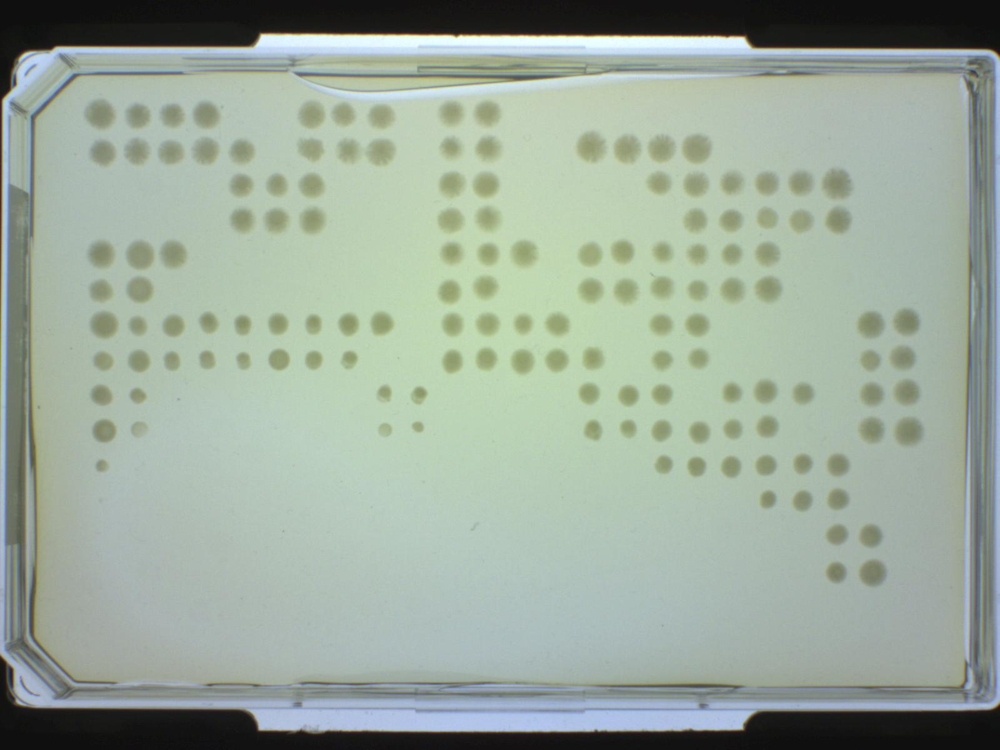

# Notes

## T 10
 - dropped old assay plate (T9 P6) at the very end (i.e. after spotting). shouldn't influence the experiment, but unclear what happened.
###  Consequences
- freeze plate 0,4,6,8,10,12 insteat of 0,3,6,9,12
-  No spottet Agarplates for T9_P6

## Day: T12 - Regarding T10, T11
- The strainplates showed that one replicate each of the  the A_r and B_r reservoir were contaminated
- Introduced the forced Turnover parameter to eliminate the wells affected by this contamination.
- change proposed for next run. Change strainplate design to avoid such contaminations
- Spot and return strainplate in one cycle to act faster

## Day T13
- Hot fix from yesterday to eliminate contamination didn't work due to a bug in the code
- Today corrected the bug
- Now the number of contaminated rwells grew to five. They hopefully will be replaced by turnover today.
---
- Liquid System Pump broke somewhere after the start of transfer 12
	- Transfer 13 is posponed to monday (3.5.21) (today is the 30.4.21) after the service repaired the pump
	- Meanwhile all plates are in the fridge
--- 03. May
- Pump fixed
- Continued experiment

## 2021-05-03
- 20:48 grip error
	- lid handling when returning agar plates after spotting plate 2. Lid for plate A was not in shelf but on the workdeck.

## 2021-05-04
- power cut
- check RoMa & continue with plate 3

## 2021-05-09
- Transfer 16/17 
- Assayplate fell down while putting T16-P1 on "Trash"
	- unusable 
- Error occured because the roma was missaligned at Y- and X- axis
- During recovery also T16-P1 assayplate was ruined
- Roma Gripstrength and alignment was adjusted

dca: was gripstrength the issue? 
 on the image hotel 3 and hotel 4 are reversed. I know that they should be the same, however, they are probably not and teaching is specific to hotels. Also Hotel 4 looks to be not properly seated on the workdeck.

## 2021-05-11
- problem with spotting of T16_P2_N: it seems not all wells were transfered 
- T18: Strainplate replica one each of A_r and B_r did not grow. See picture in check strain plate 
	